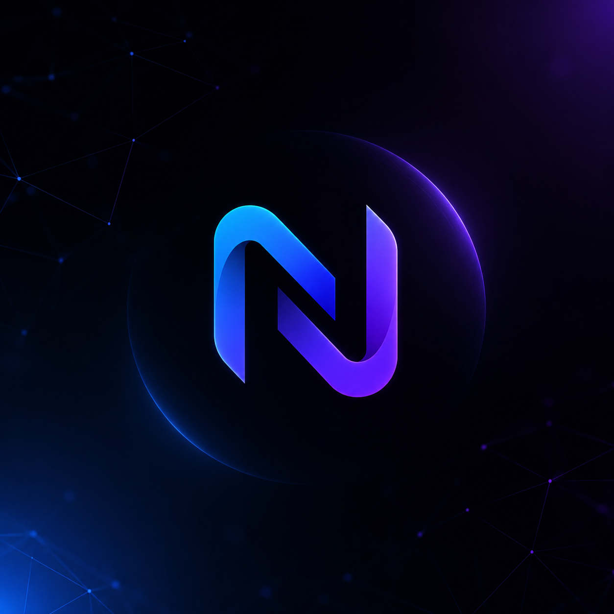

<p align="center">
  
</p>

<h1 align="center">Nexiom API</h1>
<p align="center"><b>One AI endpoint. It answers every time.</b></p>

<p align="center">
  <a href="#quickstart">Quickstart</a> ·
  <a href="#how-it-works">How it works</a>
</p>

---

Nexiom is a single chat-completions endpoint sitting in front of a chain of
independent inference paths. If one is throttled, slow, or down, the request
quietly moves on to the next — your code never sees the difference.

## Features

- **One endpoint, one key** — same request shape as any standard chat
  completions API, nothing provider-specific to learn.
- **Automatic failover** — a busy or failing path is skipped in real time,
  no retries needed on your end.
- **No lock-in** — swap or add inference paths behind the scenes without
  ever changing a line of your integration.

## Quickstart

```bash
curl https://nexiom.dev/api/v1/chat/completions \
  -H "Authorization: Bearer $NEXIOM_KEY" \
  -d '{ "messages": [{ "role": "user", "content": "still there?" }] }'
```

Same request/response shape you already know. See the live site for the
JavaScript and Python examples too.

## How it works

1. **You send one request** — one base URL, one key, the usual message body.
2. **Nexiom finds a healthy path** — it checks what's fastest and available
   right now.
3. **You get an answer, not an error** — if a path is throttled or down,
   Nexiom re-routes before it ever reaches your code.

## Project structure

```
nexiom-api/
├── index.html, style.css, script.js, logo.png   → the public site
└── api/v1/chat/completions.js                   → the gateway
```

---

<p align="center"><sub>hello@nexiom.dev is a placeholder in the site footer — swap it for a real inbox before sharing the link around.</sub></p>
